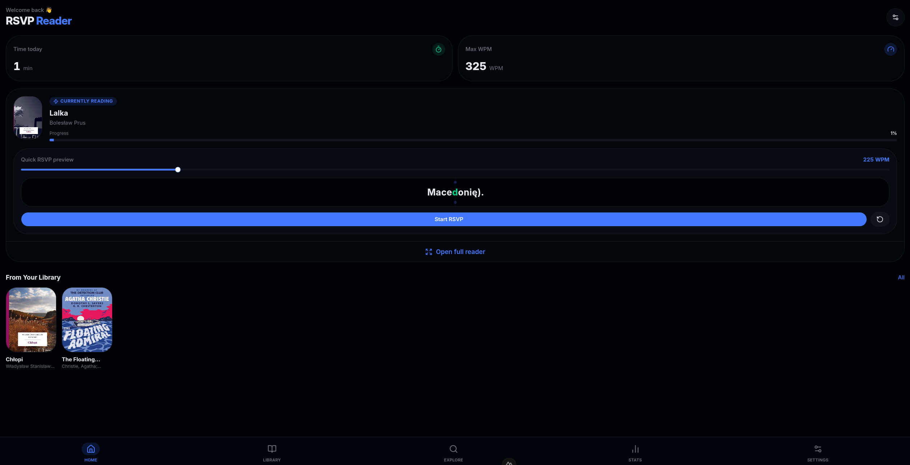
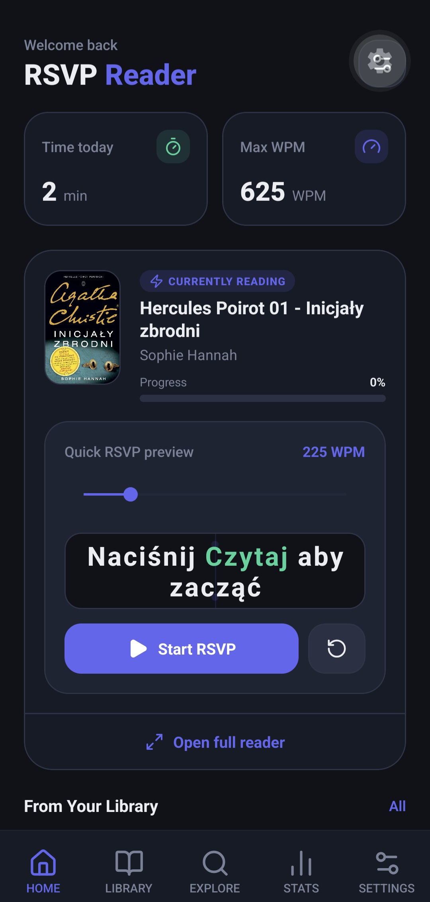
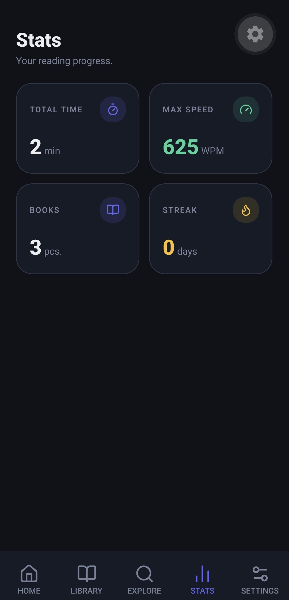

# RSVP Speed Reader 🚀

A modern speed reading ecosystem consisting of a web application and a standalone native mobile app. Both apps use the **RSVP (Rapid Serial Visual Presentation)** reading technique to display text word-by-word at a speed of up to 1000 WPM, complete with an **Optimal Recognition Point (ORP)** visual indicator to maximize reading retention and speed.

---

## 📁 Project Structure

This repository is organized as a monorepo containing two independent applications:

*   **[`web_app/`](./web_app)**: Web speed reader built with **Nuxt 3** and **SQLite (Drizzle ORM)**.
*   **[`mobile_app/`](./mobile_app)**: Fully standalone mobile app built with **React Native (Expo Router)** and **SQLite (expo-sqlite)**.

---

## 📸 Screenshots

> Add real screenshots at `assets/web_reader.png`, `assets/mobile_reader.png`, and `assets/stats_dashboard.png` to populate the gallery below.

| Web Reader | Mobile Reader | Stats Dashboard |
|---|---|---|
|  |  |  |

---

## 🤝 Contributing

See [CONTRIBUTING.md](./CONTRIBUTING.md) for branch naming, commit message format, issue/PR conventions, and local testing instructions.

---

## ✨ Features

### RSVP Reading Engine
*   **Adjustable Reading Speed**: From 100 to 1000 Words Per Minute (WPM).
*   **Optimal Recognition Point (ORP)**: Highlights the focus letter of each word in red, aligning it to the center for faster comprehension.
*   **Reading Progress Bar**: Visual indication of progress inside chapters.
*   **Quick Rewind**: A dedicated button to rewind exactly **15 seconds** of reading time (dynamically calculated based on WPM) if you lose focus.

### Book Search & Import
*   **Online Search**: Search Anna's Archive directly from the app by **title, author, language, format, and sort options**. Results open the book's Anna's Archive download page in your browser, where you download the file and import it locally — no server-side fetching of copyrighted files.
*   **On-Device File Parser**: Import local `.epub` and `.txt` files directly. The files are parsed entirely on-device (no servers required!).
*   **Manual Text Entry**: Paste articles or custom text clips directly into the library.

### Library & Statistics
*   **Offline Storage**: All books, parsed chapters, reading history, and progress are stored locally on the device (SQLite).
*   **Interactive Stats Dashboard**: Tracks daily active streaks, total read words, active sessions, and average reading speed (WPM).
*   **Progress Synchronization**: Resumes reading exactly where you left off when entering the reader screen.

---

## 🛠️ Production Build & Installation

### 1. Web Application (`web_app`)

To build and run the web application in a production-ready mode (using Nuxt's high-performance server bundle and SQLite):

```bash
# Navigate to web directory
cd web_app

# Install dependencies
bun install

# Push database migrations and build schema
bun run db:push

# Build the optimized production bundle
bun run build

# Start the production server
bun run start
```

The web app will run continuously and be available at `http://localhost:3000`.

---

### 2. Standalone Mobile App (`mobile_app`)

To install and make the application permanently available on your mobile phone, choose one of the following production methods:

#### Method A: Direct Release Install via USB Debugging (Fastest local install)
If you have your Android phone connected with **USB Debugging** enabled:

```bash
# Navigate to mobile directory
cd mobile_app

# Install dependencies
npm install

# Compile the release build locally and install it directly on the connected phone
npx expo run:android --variant release
```
This builds and installs the standalone, independent app directly onto your phone without requiring Metro server to be running afterwards.

#### Method B: Standalone APK Compilation (EAS Cloud Build)
If you want to compile a standalone `.apk` file that you can share or download and install on any phone:

```bash
# Install EAS CLI globally
npm install -g eas-cli

# Log in to your Expo account (creates one if needed)
eas login

# Build a standalone installer APK
eas build --platform android --profile preview
```
Once the build completes, EAS will provide a direct **download link** or **QR code**. Scan it or download the `.apk` file, transfer it to your phone, and install it.

---

## 🧪 Running Tests

### Mobile App (`mobile_app`)
Unit tests are written using **Jest** and **ts-jest** to verify URL queries, HTML search parsers, and local file scheme routing.

```bash
cd mobile_app
npm test
```

### Web App (`web_app`)
Unit tests are written using **Bun's native test runner** to verify backend HTML parsers, cleaners, and validation pipelines.

```bash
cd web_app
bun test
```

---

## 📄 License

This project is licensed under the MIT License - see the LICENSE file for details.
